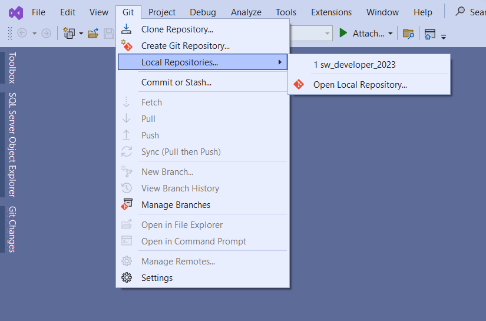
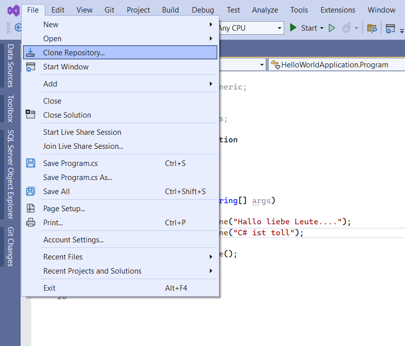
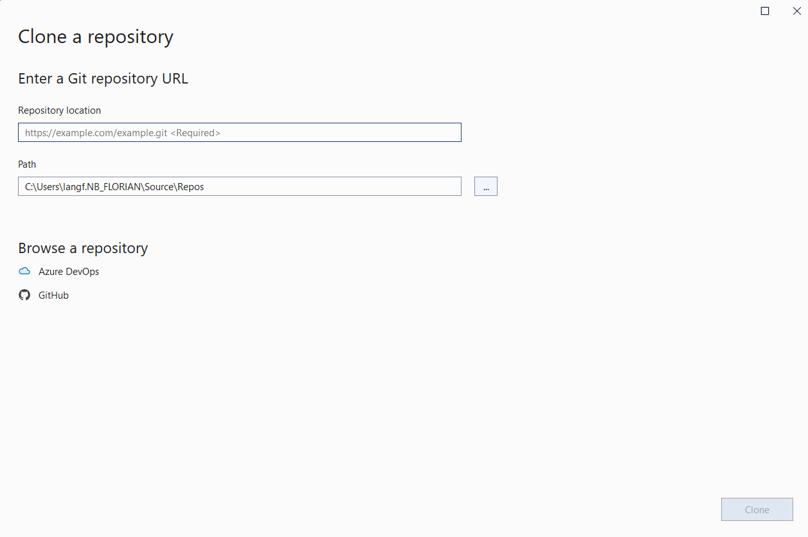
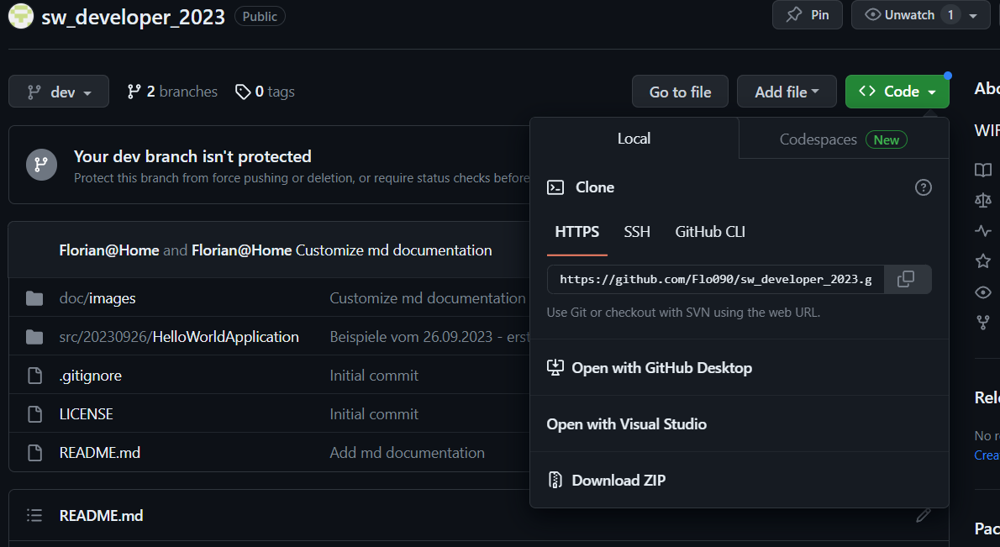
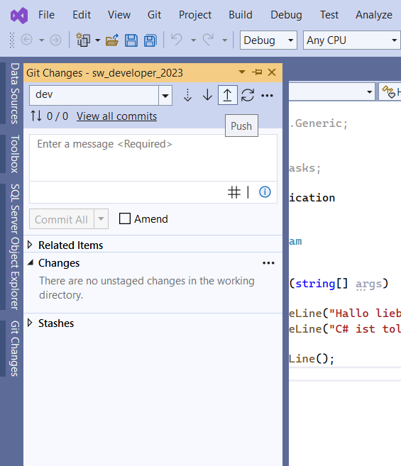

## Bei vorhandender Repository

## Clone Repository
Bei erstmaliger Verwendung der Repository

Repository location -> von Github.com kopieren (siehe nächstes Bild)  
Path: C:\myCode\Repos\sw_developer_2023  

  

Repository Link kopieren für Visual Studio  

## Commit und Push

Falls Änderungen vorhanden sind Commit All und anschließend Push auswählen.