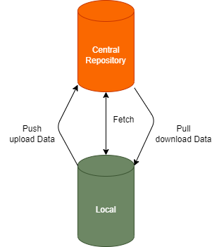

# GIT - Version Control System

- Central Repository
- Local Repository
- Push
- Pull
- Fetch

## Branches

Der Master Branch eines Repositorys, auch Main Branch oder Hauptzweig genannt,
enthält den aktuellen Versionsstand einer Software. Von dieser Hauptlinie lassen
sich weitere Branches abzweigen, z. B. zum Entwickeln und Testen, und später
wieder mit dem Master Branch verschmelzen.

##
- Commits
- Merge
- dev-Branch

